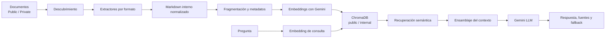

# Alianza F1 Knowledge Agent

## Descripción

Agente documental corporativo basado en RAG (*Retrieval-Augmented Generation*) para consultar conocimiento empresarial mediante lenguaje natural. La aplicación procesa documentos, genera embeddings, recupera los fragmentos más relevantes y utiliza Gemini para responder exclusivamente con base en las fuentes encontradas.

El proyecto fue desarrollado para el desafío **Alura Agente**, con una arquitectura modular y fácil de probar. Puede ejecutarse localmente con Python o Docker y cuenta con un despliegue realizado en Oracle Cloud Infrastructure (OCI).

## Objetivo

Facilitar el acceso al conocimiento de una empresa mediante un asistente que:

- procese documentación empresarial en distintos formatos;
- separe el conocimiento público del privado;
- encuentre información por similitud semántica;
- genere respuestas fundamentadas;
- cite el documento, la sección o la página utilizada;
- informe claramente cuando los documentos no contienen la respuesta.

## Arquitectura general


## Interfaz


### Flujo del RAG

1. **Descubrimiento:** localiza los documentos de la empresa activa dentro de `Public`, `Private` o ambas ubicaciones.
2. **Extracción:** selecciona un extractor según la extensión y convierte el contenido a un modelo Markdown interno.
3. **Fragmentación:** divide cada sección en fragmentos configurables, conservando el encabezado como contexto fijo y aplicando solapamiento al cuerpo.
4. **Metadatos:** conserva empresa, visibilidad, archivo, ruta relativa, sección, página cuando aplica y referencia del fragmento.
5. **Indexación:** genera embeddings con Gemini y los persiste en ChromaDB usando distancia coseno.
6. **Separación de acceso:**
   - `public`: contiene únicamente documentos `Public`;
   - `internal`: contiene documentos `Public` y `Private`.
7. **Recuperación:** convierte la pregunta en embedding y obtiene los fragmentos semánticamente más cercanos. También admite filtros por visibilidad, archivo y sección desde el módulo de recuperación.
8. **Generación:** entrega la pregunta y el contexto recuperado al LLM, valida las referencias utilizadas y presenta las fuentes.
9. **Fallback:** si no existe contexto o la salida no está respaldada correctamente, responde que no encontró la información en los documentos disponibles.

## Tecnologías

- **Python 3.12**
- **Streamlit** para la interfaz web
- **Google Gen AI SDK** para embeddings y generación con Gemini
- **ChromaDB** como índice vectorial local persistente
- **python-docx** para documentos DOCX
- **pypdf** para PDF con texto nativo
- **python-dotenv** para secretos y configuración de infraestructura local
- **Docker y Docker Compose** para ejecución reproducible
- **unittest** para pruebas automatizadas

El proyecto no depende de LangChain ni LangGraph. La orquestación se realiza mediante servicios y funciones Python sencillas.

## Funcionalidades implementadas

- Organización de documentos por empresa y visibilidad.
- Perfiles de consulta `public` e `internal`.
- Carga, listado y eliminación de documentos desde Streamlit.
- Extractores modulares para:
  - `.md`
  - `.markdown`
  - `.txt`
  - `.docx`
  - `.pdf` con texto nativo
- Rechazo explícito de `.doc`, PDF escaneado y formatos no soportados.
- Conservación de títulos, párrafos, listas y tablas de DOCX como Markdown interno.
- Conservación de la página de origen en PDF.
- Fragmentación configurable con tamaño máximo y solapamiento.
- Indexación por lotes, progreso visible y máximo de dos reintentos ante errores HTTP 429.
- Reanudación de indexaciones sin duplicar fragmentos ya almacenados.
- Índices persistentes separados en directorios fijos `public` e `internal`.
- Reconstrucción completa de ambos índices cuando cambia el modelo o la dimensión de embeddings.
- Bloqueo de consultas mientras exista una reindexación pendiente.
- Recuperación semántica con metadatos y distancia coseno.
- Respuestas documentales con archivo, sección o página de origen.
- Panel de documentos consultados.
- Métricas de empresa, perfil, modelos, fragmentos recuperados y tiempo de respuesta.
- Botón de diagnóstico para probar directamente el modelo LLM.
- Feedback con pulgar arriba o abajo almacenado durante la sesión de Streamlit.
- Scripts independientes para inspeccionar cada etapa del pipeline.
- Pruebas unitarias con proveedores simulados, sin depender de llamadas reales a Gemini.

## Formatos documentales

| Formato | Estado | Tratamiento |
|---|---:|---|
| Markdown (`.md`, `.markdown`) | Soportado | Conserva estructura y sintaxis Markdown |
| Texto (`.txt`) | Soportado | Convierte el texto al modelo interno |
| Word (`.docx`) | Soportado | Conserva encabezados, párrafos, listas y tablas |
| PDF nativo (`.pdf`) | Soportado | Extrae texto por página |
| Word antiguo (`.doc`) | No soportado | Debe convertirse a `.docx` |
| PDF escaneado | No soportado | OCR pendiente |
| Imágenes | No soportado | Procesamiento visual pendiente |

## Estructura del proyecto

```text
alianza-f1-knowledge-agent/
├── Agente/
│   ├── AlianzaF1/
│   │   ├── Public/                 # Documentos versionables
│   │   └── Private/                # Documentos locales ignorados por Git
│   ├── app/
│   │   ├── configuracion.py        # Configuración centralizada
│   │   ├── generacion/             # Prompt, proveedor LLM y respuesta
│   │   ├── procesamiento/
│   │   │   ├── extractores/        # Extractores desacoplados por formato
│   │   │   ├── descubrimiento.py
│   │   │   ├── fragmentacion.py
│   │   │   ├── embeddings.py
│   │   │   ├── indice_vectorial.py
│   │   │   └── modelos.py
│   │   ├── recuperacion/           # Búsqueda y ensamblaje del contexto
│   │   └── servicios/              # Integración del pipeline con la UI
│   ├── config/                     # Configuración operativa persistente
│   ├── tests/                      # Pruebas unitarias
│   ├── .env.example
│   ├── indexar_fragmentos.py
│   ├── inspeccionar_descubrimiento.py
│   ├── inspeccionar_extraccion.py
│   ├── inspeccionar_fragmentacion.py
│   ├── inspeccionar_recuperacion.py
│   ├── inspeccionar_respuesta.py
│   ├── interfaz_streamlit.py
│   └── requirements.txt
├── Cursos/                         # Material de estudio, fuera de Docker
├── .dockerignore
├── .gitignore
├── Dockerfile
├── docker-compose.yml
└── README.md
```

La regla `Agente/*/Private/` evita versionar los documentos privados de cualquier empresa. El archivo `.env`, la configuración operativa local y `.vectorstore` también están excluidos de Git.

## Requisitos

### Ejecución local

- Python 3.12
- `pip`
- Una API key válida de Gemini

### Ejecución con contenedores

- Docker
- Docker Compose

## Instalación local

### 1. Obtener el repositorio

Clona el repositorio desde su página real de GitHub y entra en la carpeta del proyecto:

```bash
cd alianza-f1-knowledge-agent
```

### 2. Crear y activar el entorno virtual

En Windows PowerShell:

```powershell
python -m venv .venv
.\.venv\Scripts\Activate.ps1
```

En Linux o macOS:

```bash
python3 -m venv .venv
source .venv/bin/activate
```

### 3. Instalar dependencias

```bash
python -m pip install --upgrade pip
python -m pip install -r Agente/requirements.txt
```

### 4. Crear el archivo de infraestructura

En Windows:

```powershell
Copy-Item Agente/.env.example Agente/.env
```

En Linux o macOS:

```bash
cp Agente/.env.example Agente/.env
```

Completa `Agente/.env` con una API key válida:

```env
GEMINI_API_KEY=tu_clave_real
VECTORSTORE_DIR=.vectorstore
```

No publiques este archivo.

### 5. Inicializar la configuración operativa

No es necesario crear manualmente `configuracion_operativa.json`. La primera ejecución de la configuración centralizada crea automáticamente:

```text
Agente/config/configuracion_operativa.json
```

Para una instalación nueva, inicializa la empresa activa mediante la función centralizada:

```bash
python -c "from Agente.app.configuracion import actualizar_configuracion_operativa; actualizar_configuracion_operativa({'EMPRESA_ACTIVA': 'AlianzaF1'})"
```

El archivo se completa con la configuración disponible y los valores predeterminados del proyecto. A partir de ese momento se convierte en la fuente persistente de configuración operativa y no debe añadirse al repositorio.

### 6. Construir los índices iniciales

```bash
python Agente/indexar_fragmentos.py public --empresa AlianzaF1
python Agente/indexar_fragmentos.py internal --empresa AlianzaF1
```

La primera instrucción indexa solo `Public`. La segunda construye el índice interno con `Public` y `Private`.

Para hacer una prueba controlada con cinco fragmentos:

```bash
python Agente/indexar_fragmentos.py public --empresa AlianzaF1 --limite-fragmentos 5
```

Esta prueba parcial no elimina registros obsoletos.

### 7. Ejecutar Streamlit

```bash
streamlit run Agente/interfaz_streamlit.py
```

La interfaz estará disponible en:

```text
http://localhost:8501
```

## Ejecución con Docker

Docker utiliza Python 3.12, expone el puerto `8501` y verifica el endpoint de salud de Streamlit.

Antes de iniciar, crea `Agente/.env` y las carpetas persistentes si no existen:

```bash
mkdir -p Agente/AlianzaF1/Private Agente/.vectorstore Agente/config
```

Construir la imagen:

```bash
docker compose build
```

En una instalación nueva, inicializar la empresa mediante la configuración centralizada:

```bash
docker compose run --rm --no-deps agente \
  python -c "from Agente.app.configuracion import actualizar_configuracion_operativa; actualizar_configuracion_operativa({'EMPRESA_ACTIVA': 'AlianzaF1'})"
```

Este comando crea automáticamente `configuracion_operativa.json` dentro del volumen `Agente/config`. Si el volumen ya contiene la configuración persistente, no es necesario repetirlo.

Iniciar la aplicación:

```bash
docker compose up -d
```

Consultar el estado:

```bash
docker compose ps
```

Consultar registros:

```bash
docker compose logs -f agente
```

Detener la aplicación:

```bash
docker compose down
```

Docker Compose monta desde la máquina host:

- `Agente/config`
- `Agente/AlianzaF1/Public`
- `Agente/AlianzaF1/Private`
- `Agente/.vectorstore`

Los documentos, secretos, configuración operativa e índices vectoriales no se incorporan a la imagen.

## Configuración

La configuración está separada en dos niveles.

### Infraestructura y secretos: `Agente/.env`

| Variable | Descripción |
|---|---|
| `GEMINI_API_KEY` | Credencial utilizada por Gemini |
| `VECTORSTORE_DIR` | Directorio relativo donde se persisten los índices Chroma |

Docker lee este archivo mediante `env_file`; la aplicación no lo modifica.

### Operación: `Agente/config/configuracion_operativa.json`

El archivo se inicializa automáticamente en el primer uso de la configuración centralizada. Para cada campo toma, en orden, un valor persistente existente, la configuración disponible en el entorno durante la inicialización o el valor predeterminado. Después permanece en `Agente/config` como configuración operativa persistente.

| Campo | Valor predeterminado | Descripción |
|---|---|---|
| `EMPRESA_ACTIVA` | Sin empresa implícita | Carpeta empresarial que utilizará el agente |
| `VISIBILIDADES_PERMITIDAS` | `Public`, `Private` | Niveles documentales habilitados |
| `LLM_MODEL` | `gemini-2.5-flash` | Modelo utilizado para generar respuestas |
| `EMBEDDING_MODEL` | `models/gemini-embedding-001` | Modelo utilizado para documentos y consultas |
| `EMBEDDING_DIMENSIONS` | `3072` | Dimensión de los vectores |
| `REINDEXACION_PENDIENTE` | `false` | Bloquea consultas hasta reconstruir los índices |

La prioridad de lectura es:

1. configuración operativa persistente;
2. variable de entorno;
3. valor predeterminado.

La escritura centralizada se realiza de forma atómica mediante un archivo temporal y `os.replace`. El valor efectivo puede diferir del predeterminado cuando ya existe una configuración persistente; la interfaz muestra el modelo LLM realmente activo.

El valor predeterminado definido por el código para una configuración nueva es `gemini-2.5-flash`. La configuración operativa presente en el entorno actual utiliza `gemini-2.5-flash-lite`, que tiene prioridad sobre ese valor. En otros entornos, incluido OCI, el modelo efectivo corresponde al valor persistido y puede comprobarse en el panel de diagnóstico.

El modelo LLM puede cambiarse desde la interfaz y se aplica después de limpiar la caché del servicio. Los parámetros de embeddings no se editan desde Streamlit. Si se actualizan mediante `actualizar_configuracion_operativa()`, el sistema marca automáticamente `REINDEXACION_PENDIENTE`. La siguiente sincronización desde la interfaz elimina y reconstruye completamente los índices `public` e `internal`; la marca solo se retira si ambos terminan correctamente.

## Scripts de inspección

Las etapas pueden revisarse de forma independiente desde VS Code o la terminal:

```bash
python Agente/inspeccionar_descubrimiento.py --empresa AlianzaF1 --visibilidades Public,Private
python Agente/inspeccionar_extraccion.py --empresa AlianzaF1 --visibilidades Public,Private
python Agente/inspeccionar_fragmentacion.py --empresa AlianzaF1 --visibilidades Public,Private
python Agente/inspeccionar_recuperacion.py public "¿Qué información institucional está disponible?" --empresa AlianzaF1
python Agente/inspeccionar_respuesta.py public "¿Qué información institucional está disponible?" --empresa AlianzaF1
```

Los inspectores de recuperación y respuesta realizan llamadas a Gemini. Los tres primeros trabajan localmente con los documentos.

## Despliegue en OCI

El MVP fue desplegado en **Oracle Cloud Infrastructure** utilizando la arquitectura preparada con **OCI Compute + Docker**. Una sola instancia ejecuta Streamlit y conserva los documentos, la configuración operativa y ChromaDB en volúmenes del host.

### Arquitectura desplegada

```text
Usuario
  │
  ▼
IP pública de OCI Compute : 8501
  │
  ▼
Contenedor Streamlit
  ├── Gemini API
  ├── documentos montados desde el host
  ├── configuración operativa persistente
  └── ChromaDB persistente en el host
```

### Procedimiento reproducible

1. Crear una instancia Linux en OCI Compute.
2. Permitir el tráfico TCP al puerto `8501` en la lista de seguridad o NSG correspondiente.
3. Instalar Git, Docker y Docker Compose en la instancia.
4. Clonar el repositorio.
5. Crear `Agente/.env` directamente en la instancia.
6. Crear las carpetas persistentes del host.
7. Cargar los documentos privados por un medio seguro, sin añadirlos a Git.
8. Construir la imagen e inicializar la configuración operativa mediante la función centralizada.
9. Iniciar la aplicación:

```bash
docker compose up -d --build
```

10. Verificar el contenedor:

```bash
docker compose ps
curl http://127.0.0.1:8501/_stcore/health
```

Para el MVP no se requieren Object Storage, Vault, OKE, Load Balancer ni una base vectorial administrada. Esos servicios pueden incorporarse cuando existan necesidades reales de alta disponibilidad, administración de secretos, almacenamiento externo o escalabilidad horizontal.

## Registro de ejecución en la nube

**Estado actual:** despliegue realizado en Oracle Cloud Infrastructure.

| Dato | Registro |
|---|---|
| Servicio de OCI | OCI Compute |
| Fecha del despliegue | **[COMPLETAR FECHA DEL DESPLIEGUE]** |
| Región | **[COMPLETAR REGIÓN DE OCI]** |
| URL pública | **[COMPLETAR URL PÚBLICA]** |
| Estado del endpoint de salud | **[INSERTAR RESULTADO DEL ENDPOINT DE SALUD]** |

### Evidencias

**Aplicación ejecutándose en OCI**

**[INSERTAR CAPTURA DE LA APLICACIÓN EN OCI]**

**Estado de los contenedores**

**[INSERTAR CAPTURA DE docker compose ps]**

**Registro de ejecución**

**[INSERTAR CAPTURA O FRAGMENTO DE LOS LOGS DEL CONTENEDOR]**

## Ejecución de pruebas

Las pruebas utilizan embeddings y clientes LLM simulados; no requieren llamadas reales a Gemini.

Con el entorno virtual:

```bash
python -m unittest discover -s Agente/tests -p "test_*.py"
```

Con Docker:

```bash
docker compose run --rm --no-deps agente \
  python -m unittest discover -s Agente/tests -p "test_*.py"
```

La suite actual contiene **118 pruebas** sobre configuración, descubrimiento, extracción, fragmentación, embeddings, ChromaDB, recuperación, generación y servicios de interfaz.

## Limitaciones actuales

- No implementa OCR ni procesa PDF escaneado.
- No soporta `.doc` antiguo ni imágenes.
- No incluye reranking.
- No utiliza un umbral semántico configurable antes de generar la respuesta.
- El feedback solo permanece en `st.session_state`.
- No incluye autenticación, roles ni control de acceso para un despliegue público.
- La reconstrucción por cambio de embeddings no conserva el índice anterior ni es transaccional.

## Mejoras futuras

- OCR para documentos escaneados.
- Nuevos extractores para CSV, Excel, JSON y HTML.
- Reranking de candidatos recuperados.
- Umbral configurable de relevancia semántica.
- Persistencia y análisis del feedback.
- Autenticación y autorización por usuario o perfil.
- Pruebas de evaluación de calidad del RAG.
- OCI Object Storage para documentos.
- OCI Vault para secretos.
- HTTPS mediante proxy inverso o Load Balancer.
- Automatización controlada del despliegue.
- Limpieza y observabilidad de indexaciones fallidas.

## Seguridad documental

- `Agente/*/Private/` está excluido del control de versiones.
- `Agente/.env` nunca debe publicarse.
- `.vectorstore` está ignorado porque puede contener representaciones derivadas de información privada.
- `.dockerignore` evita copiar documentos, secretos e índices dentro de la imagen.
- Los índices `public` e `internal` permanecen separados.

Antes de publicar el repositorio, verifica siempre:

```bash
git status
git check-ignore Agente/AlianzaF1/Private/*
git check-ignore Agente/.env
git check-ignore Agente/.vectorstore
```

## Autor

**Ing. Tara Padilla — Alianza F1**

Proyecto desarrollado como parte del desafío **Alura Agente**, enfocado en inteligencia artificial aplicada a la gestión del conocimiento empresarial.
